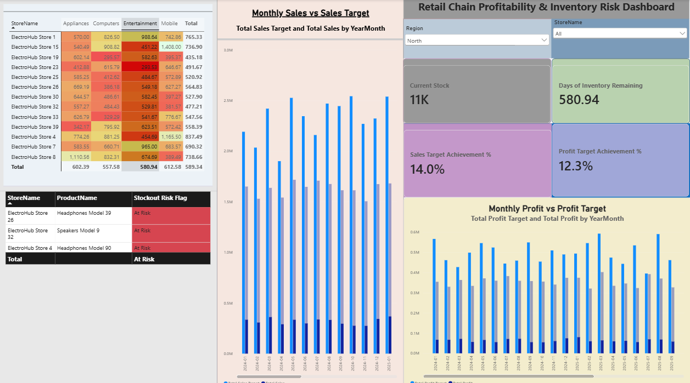

# Retail Chain Profitability & Inventory Risk Dashboard

An interactive Power BI dashboard designed to analyze retail chain profitability, sales performance, targets, and inventory risk across multiple stores and regions.

## Dashboard Preview

## Key Features

- Sales vs Sales Target analysis
- Profit vs Profit Target analysis
- Current Stock monitoring
- Days of Inventory Remaining
- Sales Target Achievement %
- Profit Target Achievement %
- Stockout Risk identification
- Store and Region filtering
- Monthly performance analysis
- Store-level product performance heatmap

## Tools & Technologies

- Microsoft Power BI
- DAX
- Data Modeling
- Data Visualization
- Interactive Slicers
- Conditional Formatting

## Dashboard KPIs

The dashboard tracks key retail performance indicators including:

- Total Sales
- Total Profit
- Current Stock
- Days of Inventory Remaining
- Sales Target Achievement
- Profit Target Achievement
- Stockout Risk

## Project Objective

The objective of this project is to provide retail management with an interactive dashboard that helps identify profitability trends, compare actual performance against targets, monitor inventory levels, and highlight products that may be at risk of stockout.

## Power BI File

The complete `.pbix` file is included in this repository for further exploration.
